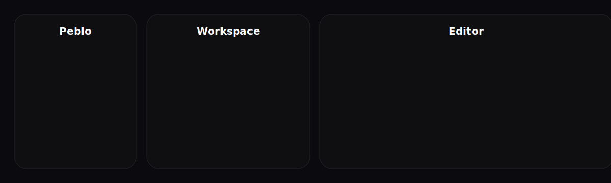
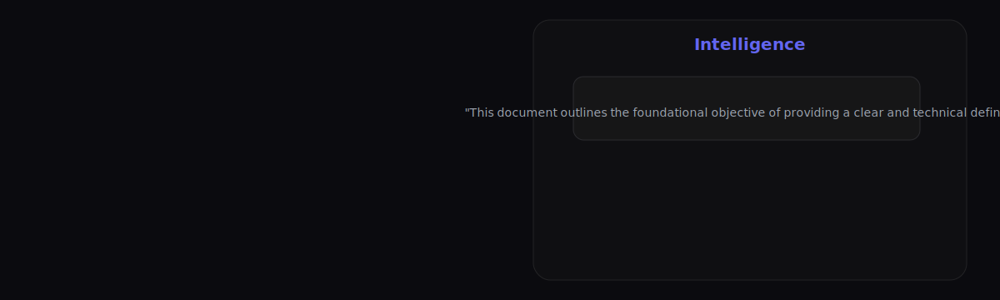

# Peblo Notes — Professional README

[](https://opensource.org/licenses/MIT) [](https://reactjs.org/) [](https://firebase.google.com/) [](https://tailwindcss.com/)

Peblo Notes is an opinionated, performance-first workspace for engineering teams and knowledge workers. It combines real-time synchronization, a focused editor, and an AI-powered intelligence panel to help teams craft, refine, and act on knowledge faster.

---

## Overview

Peblo is built to support the entire content lifecycle — from quick capture to structured deliverables. It emphasizes reliability, privacy (via Firebase security rules), and practical intelligence: extractable summaries, suggested next steps, and productivity analytics that surface actionable patterns.

Core use cases:
- Team documentation and design notes
- Research notes and evidence tracking
- Meeting summaries and action item extraction
- Personal knowledge management for engineers and product teams

---

## Key Features

- Real-time sync with Firebase Firestore and presence indicators
- AI-driven `Intelligence` sidebar for summaries, action items, and next steps
- Lightweight, fast editor optimized for long-form technical writing
- Tagging, search, and document scaffolding for discoverability
- Clean dark-first UI built with Tailwind CSS and Motion for subtle animations
- Deploy-ready Vite build and GitHub Pages support

---

## Architecture & Files

- Frontend: React + TypeScript (Vite)
- Styling: Tailwind CSS v4, small utility layer for custom scrollbars
- Backend: Firebase Auth + Firestore (security rules in `firestore.rules`)
- AI: Gemini integration (see `src/lib/gemini.ts`)
- Important files:
  - `src/components/AuthPrompt.tsx` — auth landing / login modal
  - `src/components/Logo.tsx` — wordmark component used across the app
  - `vite.config.ts` — Vite configuration and deploy base
  - `public/` — static assets and the `screenshots/` folder used by this README

---

## Screenshots

The following screenshots are provided at equal sizes for presentation and documentation. Each image is centered and scaled to the same aspect ratio to ensure consistent display across README renderers.

### Auth / Landing
![Auth Page]

*The auth modal: large Peblo wordmark with a blue dot, center-aligned CTA.*

### Workspace Overview

*Three-column workspace: sidebar, notes list, and editor pane.*

### Intelligence Panel

*AI-powered insights and extracted summary shown beside the editor.*

---

## Local Development

1. Clone the repository:

```bash
git clone https://github.com/your-username/peblo-notes.git
cd peblo-notes
```

2. Install dependencies:

```bash
npm install
```

3. Add environment variables. Create a `.env` file (see `.env.example`):

```env
VITE_FIREBASE_API_KEY=your_key
VITE_FIREBASE_AUTH_DOMAIN=your_project.firebaseapp.com
VITE_FIREBASE_PROJECT_ID=your_project_id
GEMINI_API_KEY=your_gemini_key
```

4. Start the dev server:

```bash
npm run dev
```

Build for production:

```bash
npm run build
```

---

## Deployment

This project is set up to deploy to GitHub Pages. Key points:

- `vite.config.ts` uses a relative `base: './'` to ensure pages work from subpaths.
- We recommend the GitHub Actions workflow to perform a clean install during CI to avoid optional native-binding issues: remove `node_modules` and `package-lock.json`, run `npm cache clean --force`, then `npm install --no-package-lock`.

---

## Contributing

Contributions are welcome. Please follow these steps:

1. Fork the repository
2. Create a branch: `git checkout -b feature/your-feature`
3. Commit changes with clear messages
4. Open a Pull Request to `main`

Please run `npm run build` locally and ensure no TypeScript or lint errors before submitting.

---

## Security & Privacy

- Do not commit secrets. Use environment variables and GitHub Actions secrets for CI.
- Firebase rules are enforced via `firestore.rules` — review them before updating permissions.

---

## License

This project is licensed under the MIT License. See `LICENSE` for details.

---

If you'd like I can:
- Replace the placeholder screenshots with production screenshots you provide
- Adjust the headings, typography, or add a live demo badge linking to your Pages site
- Commit and push these changes and open a Pull Request

Thank you — let me know which next step you want. 
